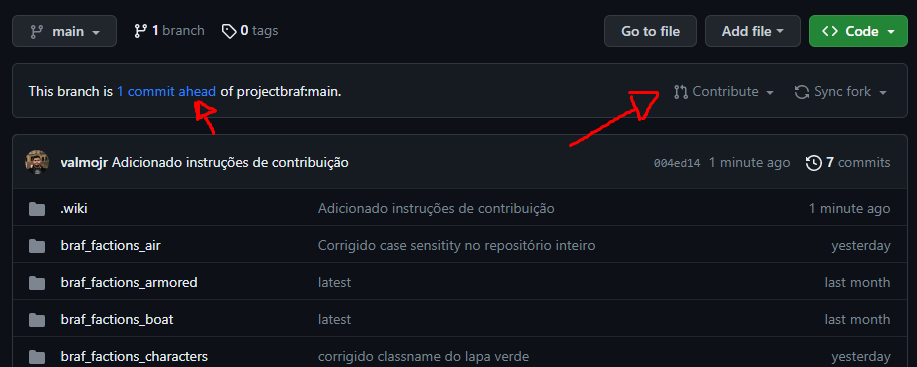
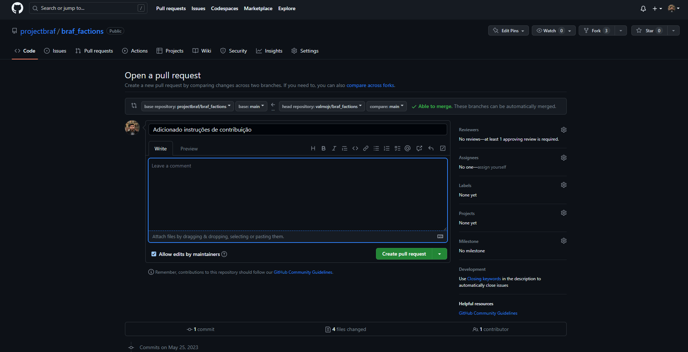
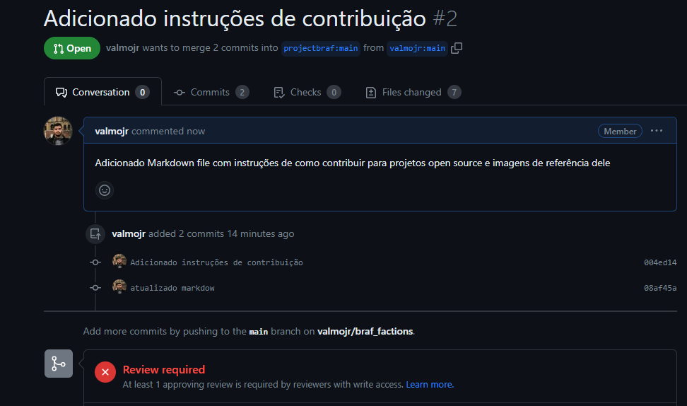
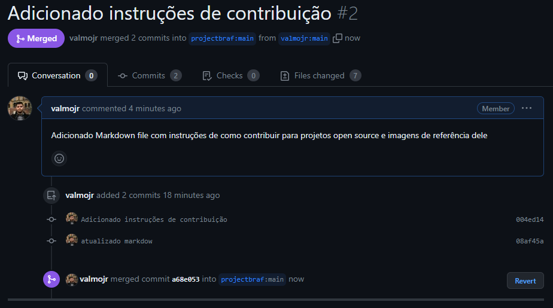
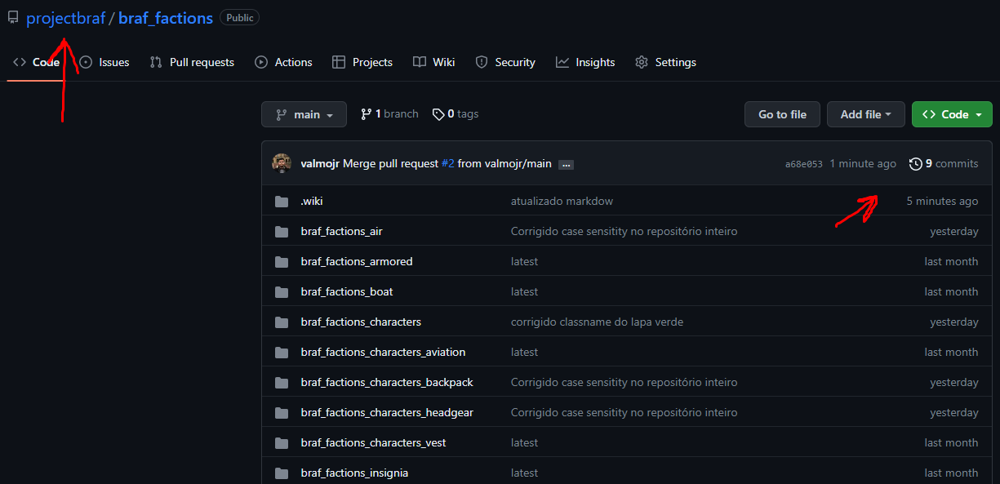
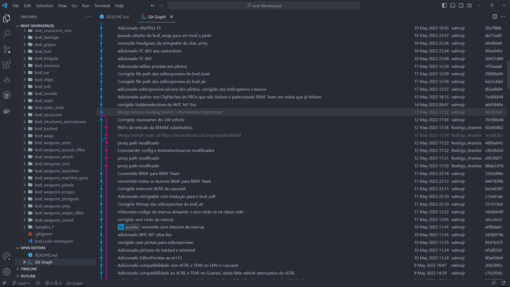

# How to contribute to BRAF Factions
BRAF Factions is a portion of BRAF intended to serve as a template for mods that use BRAF as a dependency and is developed in open source, that is, anyone can contribute to its development. Versioning is done by GitHub, this site you are on.

To get started, you need to:
- Have a registered GitHub account, if not, [click here](https://github.com/signup?ref_cta=Sign+up&ref_loc=header+logged+out&ref_page=%2F&source=header-home).
- Have Git installed on your PC, [download here](https://git-scm.com/downloads), I recommend selecting the options to allow adding Git Bash and Git GUI actions when prompted in the installer.

## What is versioning
Okay, I've installed everything I think I need, but what exactly is Git? well, for starters, imagine that you're back in your elementary school, and the teteal teacher has given you an assignment that must be turned in in a folder containing several interdependent files to be solved by you, your friend 1 and your other friend 2. Before Once you begin, you will be far from completing the task, which we will thus illustrate:

Well, the most common thing is for the group to divide and assign a part to each member, joining each part to form a work after completing each piece, right?

Ok, but what about when we need to make corrections, or small adjustments? or simply the task is continuous and the completion star is divided into several parts, how do we organize the project versions?

Complicated to understand, right? That's what Git is for, to organize your project and manage each update made by each contributor

In the first version, everyone joined their parts to the project, in the second there was an addition of friend 1 and you, in the third there was a contribution from friend 1 and friend 2, and so on. Git helps organize these changes, allowing friend 2 to work on a more delicate part from version 1 while you and friend 1 manage 4 other versions of the project and friend 2 only add your progress to the project after several versions, allowing to develop the project asynchronously.
GitHub is just a platform that will host for free (but not much, there are several limitations) the projects you want, we can make an analogy with pornography and PornHub. Here's a video explaining what GitHub is:

As stated earlier, this is a repository hosted on GitHub and everything within it is subject to improvement, including the text you are reading.

## fork
Knowing what versioning is, properly registered on GitHub and with Git installed on your machine, you can download and modify BRAF Factions, whether for your own interests, a mod that uses BRAF as a dependency, learn how to develop addons for Arma 3, that is to contribute something here. For this, we need to create a Fork in the personal profile.

Click the "Fork" Button in the upper right corner

Create the Fork on your GitHub profile by clicking "Create Fork"

Done, now I have a project fork that I can use for my interests

But that done, how do I actually have these files to work on my computer? the answer is to clone the repository.

## Clone

To clone the repository you need to get the URL of the git repository:

We have as URL of the repository

> https://github.com/your_github_user_here/braf_factions.git

and with this address in hand, it's time to clone on our machine.
Personally, I recommend that the clone be done directly in the root folder of the P Drive, in case you don't have it, or don't know how to configure the P Drive to develop mods for Arma 3, [click here](). I'll use the git command line to explain what I'm going to do to make it easier to understand the step-by-step, but everything can also be done through the Git GUI (graphical version of git). For this I will open the windows powershell and type the following commands:
> cd Q:/

I directed the terminal to the P Drive

> git clone https://github.com/your_github_user_here/braf_factions.git

I cloned the repository at the address where the terminal is, the name of the folder will copy the name of the repository, which in this case will be "braf_factions", at this time git will ask for your github credentials if they are not configured. The repository, which weighs approximately 2 GB will be downloaded.

And the clone is done on your computer:

Now you can edit whatever you want in BRAF_Factions, remembering that this tutorial can apply to anything on GitHub, whether mods like [TFAR](https://github.com/michail-nikolaev/task-force-arma-3-radio ), [ACRE2](https://github.com/IDI-Systems/acre2), [ACE](https://github.com/acemod/ACE3), [Immersion Cigs](https://github.com /rebelvg/immersion_cigs), or even the [LINUX] Kernel(https://github.com/torvalds/linux).

## Modify the repository
The changes that will be made are the addition of this page to these instructions for contributions and the images shown, I will use VS Code to make changes to the repository, and I strongly recommend that you do the same as instructed earlier.

1. The icon in VSCode from the Source Control (versioning) tab which is native to VSCode for dealing with Git.
2. The Checkbox to add the commit message (I'll explain in a moment).
3. The files that were modified in the repository
Git organizes versioning through Commits, which are points at which you define which files were modified and optionally add a message explaining what was done. For this I will select the files that I want to commit and add to the staging area (area of files that go to commit)

We can use the command "git add filename" to do the same thing with files or folders via the command line.

Note that I added all the images but kept the PT_Contributor.md file outside the commit area, added the message "Added Contribution Tutorial Images", the command "git commit" produces the commit on the command line. then with the commit message the command will be:

> git commit -m "Added contributed tutorial images"

Note that we are working on the "main" branch, which is the default for repositories originating from GitHub, which does not prevent us from creating as many branches as we want for any purpose we would like, branches are nothing more than ways to "isolate" desired versions from the repository, like when you're working on a specific project feature and don't want to risk committing the entire project to it.
Since we have our first commit added to our local repository, if we want to transfer these modifications to our fork made on github (that is, transfer our commit to github), we can also use VS Code or the command line to perform a push, by default the repository to which the clone is made is called origin, in VS Code it is possible to do this in the lower left corner of the screen:

note that VSCode points out which branch we are working on, which in this case is the main one, and puts an asterisk on it, indicating that there are files that were changed that were not committed, VSCode also points out that the local repository is 1 commit beyond the repository origin, and when clicking on the indication it will automatically push the commit, updating the newly made changes in our github repository, the command to do the same action is:

> git push origin main

Being origin the origin repository that was cloned and main a branch of it.

If you want to add your contribution to the original BRAF Factions repository, it's time to open a Pull Request, for that I will create a new commit and prepare to add it to the original repository.

## Pull Request

Note that GitHub has already detected that the personal repository is one commit above the projectbraf repository, which adds the contribute option that we will use to create the Pull Request.

Now we have the Pull Request screen, where we can optionally add more information about what we would like to add, to facilitate the work of whoever checks the Pull Request and approves it.

BRAF Factions Pull Requests require approval by a developer to be merged into the original repository in order to prevent malicious pull requests to the repository.

After PR approval, the changes will be merged into the repository

And they will then be available to the public, contributing to the development of the project.

## Final considerations
- This flow of opening a PR before contributing will not always be mandatory, especially when the repository administrator is adding contributions, it all depends on the security rules defined in each GitHub repository, some repositories are public and do not require a Pull Request and checks for changes, which means anyone can delete items as they see fit.
- I recommend installing the Git Graph extension for VS Code, which allows you to graphically check the history of commits in a repository and how they were handled.

